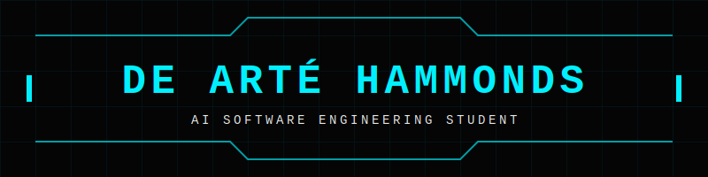

  

 

  

 

  
I am a developer with a foundation in web development, currently completing an AAS in AI Engineering at Maestro University. 
     My focus is bridging backend architecture with machine learning and Large Language Models to build functional production environments.

  <h3>Web Development Foundation</h3>
  
  
  
  
  <h3>Current Focus: OOP & Backend</h3>
  
  
  
  

---
### Technical Focus
* **Languages:** Python
* **Architecture:** Backend systems, agentic frameworks, API integration
* **Applied AI:** Prompt engineering, autonomous agents, functional LLM wrappers
  
---
### 🔭 Currently Working On
* **LLM Arena:** A lightweight web app for quickly wiring up, routing between, and evaluating multiple AI models (local and API) in one place.
* **Backend Architecture:** Designing RESTful APIs, implementing secure authentication, and working with SQL/NoSQL databases.
* **AI Integration:** Preparing for deep dives into ML fundamentals, prompt engineering, and LLM implementations.
* **Transitioning concepts** from Maestro University coursework directly into production logic.

---
### ⭐ Featured Projects
- [Artè Cipher](https://github.com/Of-Arte/modern-vigenere-cipher): A cryptographic CLI tool built around a modern One Time Pad (OTP) engine, demonstrating data transformation using rotating stacks/queues, Unicode normalization, and persistent JSON vault storage.
- [Read It Later](https://github.com/Of-Arte/read-it-later/): A URL manager powered by FIFO queues and LIFO stacks. Focuses on clean Python architecture, utilizing dispatch tables for command routing and comprehensive debug tracing.
- [Obsidian Protocol](https://obsidian-chatbot-eight.vercel.app): A React/TypeScript stock options analyst leveraging the Gemini API. Focuses on frontend state management, adaptive prompt engineering, and localized session persistence.

---
### 🐍 Contribution Activity

    <picture>
          <source media="(prefers-color-scheme: dark)" srcset="https://raw.githubusercontent.com/Of-Arte/Of-Arte/output/github-snake-dark.svg" />
          <source media="(prefers-color-scheme: light)" srcset="https://raw.githubusercontent.com/Of-Arte/Of-Arte/output/github-snake.svg" />
          
        </picture>

 

---
### 📫 Connect

  

 
